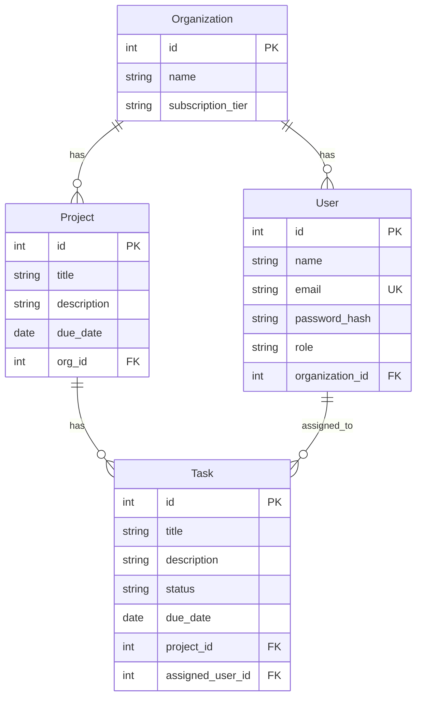

# Project Management SaaS — FastAPI Backend

Multi-tenant backend with JWT auth, role-based access, and Postgres.

## Features
- Organizations (multi-tenant), Users (Admin/Member), Projects, Tasks
- JWT auth (login/register org & admin)
- Role-based access control
- Task filters (due=today|week, status)
- Org dashboard metrics + per-project aggregation (GROUP BY)
- OpenAPI docs at `/docs`
- Alembic migrations
- Dockerized (api + db)


## Docker
```bash

docker compose up --build
```

## Auth Flow
1. `POST /auth/register_org` → create organization + first admin user
2. `POST /auth/login` → obtain JWT access token
3. Use `Authorization: Bearer <token>` for subsequent requests
4. Admin-only:
   - Invite users: `POST /users/invite`
   - Change role: `PATCH /users/{user_id}/role`
   - Create/Update/Delete projects
5. Members:
   - CRUD only **their** own tasks

## ERD (Mermaid)


## Migrations
- Alembic preconfigured. To generate future migrations:
```bash
alembic revision --autogenerate -m "desc"
alembic upgrade head
```

## Test Users
- Register an org via `/auth/register_org`, then login.
```json
{
  "org_name": "Acme Inc",
  "subscription_tier": "free",
  "admin_name": "Alice",
  "admin_email": "alice@acme.com",
  "password": "Password123!"
}
```
